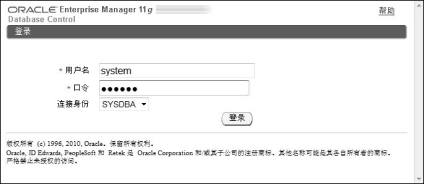
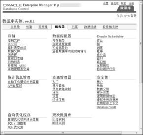
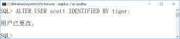
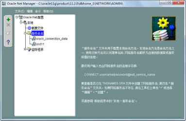
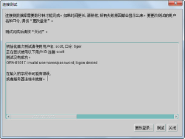

## 1.7  Oracle初使用

 

&emsp;&emsp;本章第1.5节已经介绍了如何在Windows 7环境下安装Oracle 11g数据库，并介绍了如何启动和关闭Oracle数据库服务器。安装的目的是使用，本节将介绍如何使用不同的工具操作Oracle数据库，其中将重点介绍使用PL/SQL Developer工具。

### 1.7.1  Oracle企业管理器  

&emsp;&emsp;在Oracle 11g安装结束时，会自动打开一个浏览器窗口，使用SYS或SYSTEM账号并以SYSDBA身份登录（见图1.18）以后，可以访问Oracle企业管理器（Oracle Enterprise Manger，OEM），如图1.19所示。


<p align="center"></p>  
<p align="center">图1.18  登录Oracle企业管理器</p>  


&emsp;&emsp;OEM是一个基于Java框架开发的集成化管理工具，采用Web应用方式实现对Oracle运行环境的安全管理。可以对单个Oracle数据库进行管理，包括系统监控、性能诊断与优化、系统维护、对象管理、存储数据、安全管理、作业管理、数据备份和恢复数据移植等，也可对多个Oracle数据库进行集中管理。作为数据库管理员，可以从任何地方通过特定的网络地址访问OEM，并对数据库和其他服务进行各种管理和监控操作。

&emsp;&emsp;访问OEM的URL地址为https://hostname:port/em ，其中hostname为主机名或主机IP地址，port为端口号，默认为1158。如果通过该URL 不能访问OEM，则需检查与Oracle相关的服务是否开启。

&emsp;&emsp;通过OEM，数据库管理员可以操作、管理Oracle数据库。作为软件开发人员，可以通过OEM的“方案”页面，完成操作表、索引、视图等对象的功能，如图1.20所示；通过“服务器”页面，可以完成创建、管理用户，操作表空间等功能，如图1.21所示。关于OEM能实现的对于软件开发人员来说有用的功能，会随着课程的进行而逐步深入学习。

 


<p align="center"></p>  
<p align="center">图1.19  Oracle企业管理器</p>  


<p align="center"></p>  
<p align="center">图1.20  OEM“方案”页面</p>  


<p align="center"></p>  
<p align="center">图1.21  OEM“服务器”页面</p>  


### 1.7.2  SQL*Plus  

&emsp;&emsp;SQL\*Plus是Oracle数据库中执行SQL语句的主要工具之一，它是Oracle公司为执行SQL语句以及编写、处理PL/SQL语言程序（PL/SQL是过程化SQL语言，它是Oracle数据库对SQL语句的扩展，在普通SQL语句的使用上增加了编程语言的特点。PL/SQL是把数据操作和查询语句组织在PL/SQL代码的过程性单元中，通过逻辑判断、循环等操作实现复杂的功能或者计算的程序语言）而提供的一种开发环境。在SQL\*Plus中，可以运行DML、DDL等标准的SQL语句，也可以运行Oracle一些特有的命令，如connect、exit等。

&emsp;&emsp;通过单击“开始”→“所有程序”→“Oracle - OraDb11g_home1”命令，选择“应用程序开发”下的“SQL Plus”选项，即打开SQL\*Plus界面。输入用户名、密码，这里选择输入HR账户的用户名和密码，SQL*Plus提示连接到Oracle数据库，如图1.22所示，表示登录成功。


<p align="center"></p>  
<p align="center">图1.22  SQL*Plus界面</p>  


&emsp;&emsp;当出现SQL>提示符后，直接输入SQL语句，用“;”表示SQL语句结束，按Enter键即可执行SQL语句。系统默认的HR账号可以访问若干个表，其中包括地区表REGIONS，在SQL*Plus中执行SELECT * FROM REGIONS语句的结果如图1.23所示。


<p align="center"></p>  
<p align="center">图1.23  使用SQL*Plus执行SQL语句</p>  


&emsp;&emsp;SQL\*Plus作为一款历史悠久的Oracle工具，具有的功能主要包括：执行SQL和PL/SQL语句，执行、生成SQL脚本，数据库的维护（如启动、关闭等），数据导出，用户管理和权限维护等。

&emsp;&emsp;除了以用户名、密码的验证方式登录外，SYS账户还可以使用DBA角色登录数据库：打开CMD命令，直接输入SQLPLUS / AS SYSDBA即可登录，如图1.24所示。


<p align="center"></p>  
<p align="center">图1.24  以DBA角色登录数据库</p>  


&emsp;&emsp;还可以通过SQL*Plus进行一些简单的查询及其他操作，介绍如下。

- 查询当前数据库名称

&emsp;&emsp;执行以下SQL语句，查询结果如图1.25所示。


```
SELECT name FROM v$database ;
```


- 查询账户状态

&emsp;&emsp;执行以下SQL语句，查询结果如图1.26所示。


```
SELECT username,account_status FROM dba_users ;
```


- 解锁用户

&emsp;&emsp;假定scott用户为锁定状态，就可以使用DBA角色的用户为其解锁，解锁语句：


```
ALTER USER scott ACCOUNT UNLOCK ;
```


&emsp;&emsp;结果如图1.27所示。


<p align="center"></p>  
<p align="center">图1.25  查询当前数据库名称</p>  


<p align="center"></p>  
<p align="center">图1.26  查询账户状态</p>  


<p align="center"></p>  
<p align="center">图1.27  解锁用户</p>  


- 重置密码

&emsp;&emsp;如果需要为某用户修改密码（如scott），也可以使用DBA角色的用户通过以下语句实现，结果如图1.28所示。


```
ALTER USER scott IDENTIFIED BY tiger ;
```


<p align="center"></p>  
<p align="center">图1.28  修改用户密码</p>  


&emsp;&emsp;如此，就将scott用户的密码修改为了tiger。

&emsp;&emsp;再次强调，解锁用户及修改密码操作一定要在DBA角色下执行。

### 1.7.3  为PL/SQL Developer配置网络服务名  

&emsp;&emsp;PL/SQL Developer（以下简称PL/SQL Dev）是一个集成开发环境，专门面向Oracle数据库而开发。使用PL/SQL Dev，作为程序员可以方便地操作、管理Oracle服务器。它运行速度快，占用内存小且稳定，是一个广受程序员喜爱的Oracle客户端工具，也是本书主要使用的Oracle客户端工具。

&emsp;&emsp;Oracle是一款基于客户端/服务器端技术的数据库管理系统。将Oracle数据库安装在服务器端，数据库管理员或者软件开发人员要配置、管理或使用Oracle数据库，通常不在服务器上操作，而是在自己本机上通过一些专用客户端工具（例如PL/SQL Dev）操作数据库。要想本机上的PL/SQL Dev能找到Oracle数据库，则首先需要在本机上安装客户端库（如果本机安装了Oracle服务器，则不需要再安装客户端库），然后通过下面的步骤配置网络服务名，PL/SQL Dev通过网络服务名连接到Oracle数据库服务器。

&emsp;&emsp;单击“开始”→“所有程序”→“Oracle-OraDb11g_home1”命令，选择“配置和移植工具”下的“Net Manager”选项，打开如图1.29所示的Oracle Net Manager工具。


<p align="center"></p>  
<p align="center">图1.29  Oracle Net Manager工具</p>  


&emsp;&emsp;选择“服务命名”选项，单击左上角绿色的“+”图标，出现如图1.30所示的“网络服务名向导”对话框。

&emsp;&emsp;在“网络服务名”文本框中输入一个网络服务名称，以后就可以在PL/SQL Dev等其他客户端工具中通过这个网络服务名称连接到对应的Oracle数据库服务器。

&emsp;&emsp;单击“下一步”按钮，出现“网络服务名向导”的“选择协议”对话框，选择“TCP/IP(Internet协议)”；再单击“下一步”按钮，出现如图1.31所示的“协议设置”对话框，在该对话框中输入Oracle数据库服务器的主机名或IP地址（192.168.1.141），以及Oracle数据库的端口号（默认为1521），单击“下一步”按钮继续。


<p align="center"></p>  
<p align="center">图1.30  网络服务名向导</p>  


<p align="center"></p>  
<p align="center">图1.31  网络服务名向导之协议设置</p>  


&emsp;&emsp;出现“服务”对话框，如图1.32所示，在该对话框中输入服务名。该服务名通常为Oracle数据库服务器安装时设置的全局数据库名，本例中输入orcl11，即所配置的网络服务名将链接到IP地址为192.168.1.141、端口号为1521的Oracle数据库的orcl11这个服务上，单击“下一步”按钮继续。

&emsp;&emsp;出现“连接测试”对话框，单击该对话框上的“测试”按钮，如图1.33所示，提示测试没有成功。再单击“更改登录”，输入之前解锁的Oracle账户的用户名和密码，例如HR账户的用户名和密码，单击“确定”按钮后再单击图1.33中的“测试”按钮，直到出现如图1.34所示的连接测试成功的信息。

&emsp;&emsp;单击“关闭”、“完成”按钮，回到Oracle Net Manager工具主界面，会在“服务命名”下看到刚刚创建的NetOrcl11网络服务名。


<p align="center"></p>  
<p align="center">图1.32  网络服务名向导之服务</p>  


<p align="center"></p>  
<p align="center">图1.33  网络服务名之连接测试失败</p>  


<p align="center"></p>  
<p align="center">图1.34  网络服务名之连接测试成功</p>  


### 1.7.4  PL/SQL Dev使用  

&emsp;&emsp;PL/SQL Dev安装很简单，这里不再赘述。在客户端启动PL/SQL Dev，出现Oracle Logon对话框，如图1.35所示。正确输入HR账户用户名、密码，选择在客户端刚配置的网络服务名NetOrcl11（如果使用PL/SQL Dev在Oracle服务器端登录，则可直接通过Oracle数据库全局服务名访问数据库，不用再配置网络服务名），同时选择作为普通用户身份登录Oracle服务器。


<p align="center"></p>  
<p align="center">图1.35  PL/SQL Dev登录Oracle</p>  


&emsp;&emsp;在PL/SQL Dev主界面中，左侧列出了该登录账户在该Oracle数据库中拥有的对象资源，例如表、视图、索引、存储过程、触发器等。本例中是通过HR这个账号登录的，单击左侧树形结构的Tables文件夹，显示出了HR账号可以访问的所有表，如图1.36所示。右击选中的REGIONS表，选择Query data查询数据，右侧的上部显示了执行的SQL语句，下部显示了执行SQL语句的结果，如图1.36所示。


<p align="center"></p>  
<p align="center">图1.36  PL/SQL Dev主界面</p>  


&emsp;&emsp;关于PL/SQL Dev这个Oracle客户端工具具体如何使用，将在接下来的章节中展开。


