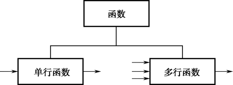

## 3.1  SQL函数
 

&emsp;&emsp;函数，和Java中的方法类似，是完成一定功能的代码集合。SQL函数是SQL语言的一个强有力特征，被广泛使用。SQL函数可以完成如下功能：

- 执行数据计算。

- 修改单个数据项。

- 格式化显示的日期和数字。

- 进行数据类型转换。

- 根据行分组操纵输出。

&emsp;&emsp;与Java中的方法不同的是，SQL函数有输入参数，并且总有一个返回值。由于篇幅的关系，本书只简要介绍作为软件开发人员最常用的函数。

&emsp;&emsp;根据函数所操作数据行数的不同，可以将SQL函数分为两类，单行函数和多行函数，如图3.1所示。其中单行函数仅对单个行进行计算，并且每行返回一个结果。在单行函数中，又可根据操作对象的不同分为字符函数、数字函数、日期函数、转换函数和通用函数，如图3.2所示。而多行函数可以操作成组的多个行，每个行组返回一个结果，这些函数又称组函数，将在后面的课程中系统介绍。单行函数可操作的输入参数，可以是常量、变量、字段名和表达式。单行函数可以在SELECT、WHERE和ORDER BY子句中出现，也可以进行嵌套。

  

图3.1  SQL函数分类 
  

  

图3.2  单行函数分类
  

