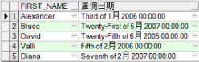

## 3.3  转换函数
 

&emsp;&emsp;和Java语言类似，既然SQL语言中有数据类型，那么就会存在数据类型转换。

&emsp;&emsp;在某些情况下，Oracle数据库需要使用某种数据类型的数据，而实际提供的却是另外一种数据类型，如果Oracle能自动将提供的数据类型数据转换为期望的数据类型的数据，这就是隐式数据类型转换。

&emsp;&emsp;在Oracle中，对于直接赋值，Oracle数据库能够自动将VARCHAR2或CHAR转换到NUMBER和DATE类型，也可以将NUMBER和DATE自动转换到VARCHAR2类型。

&emsp;&emsp;隐式数据类型转换，不只可以在上面提到的数据类型之间进行，在另一些数据类型之间也可以进行隐式转换，比如VARCHAR2可以被隐式地转换成ROWID。

&emsp;&emsp;除了隐式数据类型转换，另外一种就是使用转换函数，显式地将某种数据类型转换成另外一种数据类型，也就是本节的重点。

&emsp;&emsp;SQL语言提供了三种函数，实现从一种数据类型数据转换到另一种类型，它们分别是TO_CHAR、TO_NUMBER和TO_DATE。

### 3.3.1  对日期使用TO_CHAR函数  

&emsp;&emsp;之前，所有 Oracle 日期值默认都以 DD-MON-RR 格式显示，现在用TO_CHAR函数，将日期从默认格式转换为指定的格式，其语法形式如下：


```
TO_CHAR(date[, 'fmt'])
```


&emsp;&emsp;在使用该方法时，需要注意：格式模板必须放在单引号中，并且是大小写敏感的，格式模板可以包括任意日期格式元素。先来看一个例子，直接认识一下如何对日期使用TO_CHAR函数，其SQL语句如下：


```
SELECT TO_CHAR(SYSDATE,'YYYY/MM/DD,HH24-MI-SS') FROM dual
```


&emsp;&emsp;执行该SQL语句，结果为2013/06/17,15-44-06。在这个例子中，'YYYY/MM/DD,HH24- MI-SS' 即格式模板，格式模板中的YYYY、MI这些称为格式元素。下面列举了日期格式的部分常用元素，如表3.8所示，其中“结果”一列是针对值为2013/06/17,15-44-06的日期类型按相应格式元素输出的结果。

表3.8  日期格式元素

| 格式元素   | 说    明                 | 结    果   |
| ---------- | ------------------------ | ---------- |
| CC         | 世纪                     | 21         |
| YYYY       | 年                       | 2013       |
| YYY、YY、Y | 年的最后三、二、一个数字 | 013、13、3 |
| Y,YYY      | 年，在指定位置带逗号     | 2,013      |

 

 

续表

| 格式元素   | 说    明                                 | 结    果                   |
| ---------- | ---------------------------------------- | -------------------------- |
| YEAR       | 拼写年                                   | TWENTY   THIRTEEN          |
| BC、AD     | 根据日期自动设置为BC、AD                 | AD                         |
| B.C.、A.D. | 根据日期自动设置为B.C.、A.D.             | A.D.                       |
| Q          | 季度                                     | 2                          |
| MM         | 月：两位数字值                           | 06                         |
| MONTH      | 月份的全拼，右端补齐空格，总长为九个字符 | JUNE                       |
| Mon        | 月份的前三个字母，首字母大写             | Jun                        |
| RM         | 罗马数字月                               | VI                         |
| WW、W      | 在本年或本月的第几周                     | 24、3                      |
| DAY        | 周几的全拼，右端补齐空格，总长为九个字符 | MONDAY                     |
| DY         | 周几，前三个字母缩写                     | MON                        |
| DDD或DD或D | 在本年、本月或本周的第几天               | 168、17、2（周日为第一天） |

 

&emsp;&emsp;接下来看看fm、th和sp这三个元素的使用。

&emsp;&emsp;fm元素的作用就是用来删除填补的空或者前导0，对下面两个例子进行比较，就能很快明白。


```
SELECT TO_CHAR(SYSDATE,'YYYY/MM/DD,HH24-MI-SS') FROM dual
```


&emsp;&emsp;执行该SQL语句，结果为2013/06/17,15-44-06。


```
SELECT TO_CHAR(SYSDATE,'fmYYYY/MM/DD,HH24-MI-SS') FROM dual
```


&emsp;&emsp;执行该SQL语句，结果为2013/6/17,15-44-6。

&emsp;&emsp;th和sp元素的作用是指定后缀来影响数字的显示，th加在数字后面表示序数，sp加在数字后面让数字以英文的形式显示，两个元素也可以结合起来使用。

&emsp;&emsp;接下来列举时间格式的部分常用元素，如表3.9所示，其中“结果”一列是针对值为2013/06/17,15-44-06的日期类型按相应格式元素输出的结果。

表3.9  时间格式元素

| 格式元素       | 说    明                                                     | 结    果   |
| -------------- | ------------------------------------------------------------ | ---------- |
| AM、PM         | 根据时间自动设置为 AM 或   PM                                | PM         |
| A.M.或P.M.     | 根据时间自动设置为 A.M. 或   P.M.                            | P.M.       |
| HH、HH12、HH24 | 12小时格式（1～12）、12小时格式（1～12）、24小时格式（0～23） | 03、03、15 |
| MI             | 分钟（0～59）                                                | 44         |
| SS             | 秒（0～59）                                                  | 06         |
| SSSSS          | 从午夜12点以来经过的秒数                                     | 56656      |

 

&emsp;&emsp;为了达到更好的输出效果，可以在格式模板中直接使用标点符号，作为各元素之间的间隔。还可以在格式模板中增加字符串，增加时需要用双引号括起来。

&emsp;&emsp;假设现在需要显示雇员表中的雇员名字和雇佣日期，且雇佣日期以“Seventh of 6月 2013 15:44:6”格式显示，仅查询部门编号为60的雇员信息，其SQL语句如下：


```
SELECT first_name, TO_CHAR(hire_date, 'fmDdspth "of" Mon YYYY fmHH24:MI:SS') AS "雇佣日期" 

FROM employees

WHERE department_id = 60
```


&emsp;&emsp;该SQL语句中还同时演示了sp和th元素的使用，执行SQL语句，显示结果如图3.7所示。


<p align="center"></p>  
<p align="center">图3.7  对日期使用TO_CHAR函数</p>  

### 3.3.2  对数字使用TO_CHAR函数  

&emsp;&emsp;当数字与字符串混用且输出是字符串时，应该使用TO_CHAR函数将数字转换为需要的字符串（VARCHAR2），其语法形式如下：


```
TO_CHAR(number[, 'fmt'])
```


&emsp;&emsp;表3.10列举了将数字转换为字符时，一些常用的格式元素，其中“结果”一列是针对“输入”类的数据，按格式元素输出的结果。

表3.10  数字转换为字符格式元素

| 格式元素 | 说    明                        | 输    入     | 举    例                   | 结    果                |
| -------- | ------------------------------- | ------------ | -------------------------- | ----------------------- |
| 9        | 数字宽度（9的个数决定显示宽度） | 2468         | 999999                     | 2468（前面有两个空格）  |
| 0        | 显示前导0                       | 099999       | 002468                     |                         |
| $        | 美元符号                        | $999999      | $2468（前面有两个空格）    |                         |
| L        | 本地货币符号                    | L9999        | ￥2468                     |                         |
| .        | 指定小数点位置                  | 999999.99    | 2468.00（前面有两个空格）  |                         |
| ,        | 指定逗号位置                    | 999,999      | 2,468（前面有两个空格）    |                         |
| MI       | 将负数右边显示负号              | -2468        | 999999MI                   | 2468-（前面有两个空格） |
| PR       | 将负数加上括号                  | 9999PR       | <2468>                     |                         |
| EEEE     | 科学计数法                      | 99.99999EEEE | -2.46800E+03（前面无空格） |                         |
| V        | 乘n个10，n由V后 9 的个数决定    | 999999V99    | -246800（前面有两个空格）  |                         |

 

&emsp;&emsp;假设需要显示雇员表中的雇员名字和薪水，且薪水以“$17,000.00”格式显示，仅查询部门编号为90的雇员信息，其SQL语句如下：


```
SELECT first_name AS "姓名", TO_CHAR(salary, '$99,999.99') AS "薪水" 

FROM employees

WHERE department_id = 90
```


&emsp;&emsp;执行SQL语句，显示结果如图3.8所示。


<p align="center"></p>  
<p align="center">图3.8  对数字使用TO_CHAR函数</p>  

### 3.3.3  TO_NUMBER函数  

&emsp;&emsp;在使用SQL语言的数据类型转换过程中，不可能总是向字符类型转换，有时也需要将字符串转换成数字，这时候就需要使用TO_NUMBER函数，这个函数的语法形式如下：


```
TO_NUMBER(char[, 'fmt'])
```


&emsp;&emsp;如表3.11所示，通过一些简单的示例，介绍TO_NUMBER这个函数的使用，其中最后一个示例是先将一个日期类型转换成一个字符类型，再将字符类型转换为数字类型。

表3.11  TO_NUMBER函数示例

| 函    数                                  | 结    果 |
| ----------------------------------------- | -------- |
| TO_NUMBER('2468',   '9999')               | 2468     |
| TO_NUMBER('2468',   '999')                | 报错     |
| TO_NUMBER('2468',   '999999')             | 2468     |
| TO_NUMBER('246a', '9999')                 | 报错     |
| TO_NUMBER(TO_CHAR(SYSDATE,'YYYY'),'9999') | 2013     |

 

&emsp;&emsp;TO_NUMBER('2468', '999')这个函数报错的原因是格式模板是'999'，要求转换后的数字在-999～999范围之间，而对'2468'使用TO_NUMBER函数，其结果是2468，超过了这个范围，所以报错。TO_NUMBER('246a', '9999')这个函数报错的原因是强制对一个不能转换为数字的字符进行转换。

### 3.3.4  TO_DATE函数  

&emsp;&emsp;在将字符转换为数字时，如果该字符不能转换为数字时会报错；同样的，如果将一个不能转换为日期类型的字符进行强制转换，也会报错。

&emsp;&emsp;将字符类型转换为日期类型，需要使用TO_DATE函数，这个函数的语法形式如下：


```
TO_DATE(char[, 'fmt'])
```


&emsp;&emsp;来看一个不带格式模板的简单例子：


```
SELECT TO_DATE('17-JUN-13') FROM dual
```


&emsp;&emsp;该SQL语句在PL/SQL Dev上执行，显示的结果是2013/6/17，表明成功转换成日期类型。

&emsp;&emsp;TO_DATE函数的格式模板中可以有一个fx元素，该元素指示对需要转换的字符类型和TO_DATE函数的格式模板必须精确匹配，包括标点符号和空格。来看一个精确匹配的例子：


```
SELECT  TO_DATE('Jan 03, 2006', 'fxMon DD, YYYY') FROM dual
```

&emsp;&emsp;PL/SQL Dev上执行的结果是2006/1/3，成功转换成日期类型。稍稍调整上面的SQL语句如下（其中第一行是将字符类型中天数的“03”调整为“3”，第二行是将格式模板的“YYYY”后增加了一个空格，第三行是将格式模板的“DD”和“YYYY”之后原来的逗号改成了分号）：


```
SELECT  TO_DATE('Jan 3, 2006', 'fxMon DD, YYYY') FROM dual

SELECT  TO_DATE('Jan 03, 2006', 'fxMon DD, YYYY ') FROM dual

SELECT  TO_DATE('Jan 03, 2006', 'fxMon DD; YYYY') FROM dual
```


&emsp;&emsp;分别执行这三条SQL语句时都会报错，不能进行转换，可去掉fx这个元素，也就是说不需要再精确匹配。再次执行这三条SQL语句，都能正常显示出2006/1/3的结果。

&emsp;&emsp;假设需要查询雇员表中雇佣日期为2006年1月3日的雇员，显示雇员的名字和雇佣日期信息，其SQL语句如下：


```
SELECT first_name, hire_date

FROM employees

WHERE hire_date = TO_DATE('Jan 03, 2006', 'fxMon DD, YYYY')
```


&emsp;&emsp;执行该SQL语句，显示结果如图3.9所示。


<p align="center"></p>  
<p align="center">图3.9  TO_DATE函数</p>  

&emsp;&emsp;同样是上面的需求，可以换一个SQL语句的写法，执行结果一样。


```
SELECT first_name, hire_date

FROM employees

WHERE TO_CHAR(hire_date,'YY/MM/DD') = '06/01/03'
```


&emsp;&emsp;比较这两个SQL语句，其中第一个在WHERE子句中是将字符类型转换为日期类型，然后将两个日期类型进行比较；而第二个SQL语句则是将日期类型转换为字符类型，将两个字符类型进行比较，其结果是一样的。

 

 


