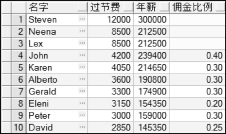
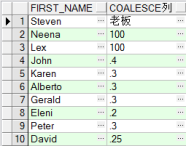

## 3.6  通用函数


&emsp;&emsp;前面主要介绍了字符类型、数字类型和日期类型的函数，以及这三种类型之间的转换。接下来，将介绍一些可以用于任意数据类型（且适用于空值）的通用函数。本小节中，主要介绍NVL、NVL2和COALESCE这三个函数。对其他一些函数，例如NULLIF、DECODE函数以及CASE表达式，有兴趣的读者可以自己学习。

### 3.6.1  NVL函数  

&emsp;&emsp;NVL函数就是用一个实际的值替换一个空值，其语法形式如下：


```
NVL(expr, value)
```


&emsp;&emsp;其中expr是可能包含空值的字段名或表达式，而value是要替换的实际值。可以使用 NVL 函数来转换任何数据类型，即expr可以是任何数据类型，但返回值通常必须和expr的数据类型相同。

&emsp;&emsp;在第2章中，使用过算术运算符计算过年薪，当时年薪的计算方式为“月薪\*12+过节费500”。实际上这样的年薪计算方式是有问题的，因为在公司中，有一部分雇员是按照刚才的方式发放全年薪酬的，还有一些雇员需要发放佣金，其佣金数额为月薪\*12\*佣金百分比。对于能发佣金的雇员，其佣金百分比字段有数值，而对于没有佣金的雇员，佣金百分比字段为空。所以，公司雇员的年薪计算方式应为“月薪\*12+过节费500+月薪\*12\*佣金百分比”，没有佣金的雇员佣金百分比按0计算。其中，没有佣金的雇员佣金百分比按0计算转换为SQL语句即NVL(commission_pct,0)。要重新计算、显示雇员的年薪，其SQL语句如下（只查询出部门编号为80或90的雇员）：


```
SELECT first_name AS "名字",(salary*12) + 500 + (salary*12*NVL(commission_pct,0)) AS "年薪", commission_pct AS "佣金比例"

FROM employees

WHERE department_id IN('80','90')
```


&emsp;&emsp;执行该SQL语句，部分显示结果如图3.10所示。


<p align="center"></p>  
<p align="center">图3.10  NVL函数</p>  

### 3.6.2  NVL2函数  

&emsp;&emsp;NVL2函数是在NVL函数的基础上再推进了一步，其语法形式如下：


```
NVL2(expr, value1, value2)
```


&emsp;&emsp;该函数的作用在于检查第一个参数，如果该参数的值不为空，则该函数返回第二个参数的值，否则返回第三个参数的值。

&emsp;&emsp;继续调整计算年薪的案例。假设过节费不再是固定值500，而是根据雇员薪酬发放方式以及底薪的不同确定过节费。其中针对没有佣金的雇员，过节费为底薪的50%，而有佣金的雇员，过节费为底薪的30%。那么过节费的数额就可以通过采用NVL2函数来确定，具体形式为NVL2(commission_pct, salary*30%, salary*50%)。重新计算、显示部门编号为80或90的雇员的年薪，其SQL语句如下：


```
SELECT first_name AS "名字",NVL2(commission_pct, salary*0.3, salary*0.5) AS "过节费",(salary*12) + NVL2(commission_pct, salary*0.3, salary*0.5) + (salary*12*NVL(commission_pct, 0)) AS "年薪",commission_pct AS "佣金比例"

FROM employees

WHERE department_id IN('80','90')
```


&emsp;&emsp;执行该SQL语句，部分显示结果如图3.11所示。


<p align="center"></p>  
<p align="center">图3.11  NVL2函数</p>  

### 3.6.3  COALESCE函数  

&emsp;&emsp;COALESCE函数比NVL函数功能强大，它能够接受多个交替的值，其语法形式如下：


```
COALESCE (expr1, expr2… exprn)
```


&emsp;&emsp;该函数的作用是，如果expr1为非空，则返回expr1的值；如果expr1为空，则返回expr2的值，依次类推，如果前面的表达式都为空，则返回exprn的值。

&emsp;&emsp;现在有这样的需求，针对雇员表进行查询，显示的结果需要有这样一列数据，如果该雇员是有佣金的雇员，则该列显示该雇员的佣金百分比，否则显示该雇员经理的编号，如果该雇员没有佣金，且没有管理他的经理，则该雇员是老板，该列显示“老板”即可，其SQL语句如下：


```
SELECT first_name,COALESCE(commission_pct, manager_id,'老板') AS COALESCE列 

FROM employees

WHERE department_id IN('80','90')
```


&emsp;&emsp;执行该SQL语句，提示数据类型不一致，应为NUMBER，但实际返回CHAR。探其原因，COALESCE函数的第一、第二个表达式都是数字类型，而第三个表达式的值“老板”是字符型的，数据类型不一致，所以报错。解决的方法很简单，将第一、第二个表达式的数字类型都强制性地转换成字符型即可，其SQL语句如下： 


```
SELECT first_name,COALESCE (TO_CHAR(commission_pct) , TO_CHAR (manager_id) ,'老板') AS COALESCE列 

FROM employees

WHERE department_id IN('80','90')
```


&emsp;&emsp;执行该SQL语句，部分显示结果如图3.12所示。


<p align="center"></p>  
<p align="center">图3.12  COALESCE函数</p>  


