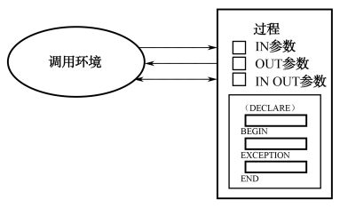
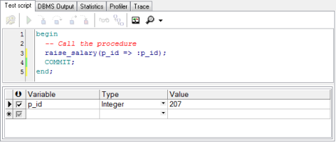

## 7.2  子程序
 

&emsp;&emsp;从本节开始，将简要地介绍一些Oracle PL/SQL编程的概念。虽然PL/SQL编程不是软件开发人员需要学习的重点内容，但其中一些重要的概念必须掌握，因为在企业面试时，经常会被问到。

### 7.2.1  子程序概述  

&emsp;&emsp;子程序是一个数据库对象，存在于数据库中，里面存放的是PL/SQL代码，可以完成一定的功能，能被程序和客户端工具直接调用。子程序类似Java中的方法，可以接收参数，按照是否有返回值的不同，子程序可以分为过程和函数。

&emsp;&emsp;子程序可以被编译和存储在数据库中，它具有模块化、重用性、可维护性、可扩展性、安全性等特点。模块化是将大的代码块分解为较小代码模块，在代码被模块化之后，模块可以被同一个程序重用，或被其他程序调用，而且较小的模块也更容易维护和调试。根据需求，可以将各个小模块组织起来，完成一些特定的功能，增强了系统的可扩展性。另外，子程序也是数据库对象，可以被授权执行，这样只有授权用户才能访问，增强了安全性。

&emsp;&emsp;子程序的程序结构如下：


```
<header>

IS | AS

声明部分

BEGIN

可执行部分

EXCEPTION（可选）

异常部分

END;
```


&emsp;&emsp;程序结构中前两行是子程序说明部分，其中header确定PL/SQL子程序的类型（过程或函数）、名称和参数列表，如果是函数的话，还会有RETURN子句。

&emsp;&emsp;从声明部分开始到最后，属于子程序的主体。在IS | AS和BEGIN之间的是声明部分，BEGIN和END之间是子程序的核心—可执行部分，其中至少包含一条语句，EXCEPTION和END之间是异常部分，这部分用于捕获预先定义的错误。

### 7.2.2  过程  

&emsp;&emsp;本小节将介绍创建过程（也称为存储过程）和调用过程，并通过一个例子让读者对过程有初步的了解。至于详细的参数模式介绍、参数默认值、异常处理等内容，有兴趣的读者可以自己深入初步的学习。

- 创建过程

&emsp;&emsp;创建过程的语法形式如下：


```
CREATE [OR REPLACE] PROCEDURE pname

​    [ (param1        [mode1]        type1,

​    param2         [mode2]        type2,

​    …)]

IS | AS

BEGIN

​    PL/SQL Block

END [pname]
```


&emsp;&emsp;语法解释如下：

&emsp;&emsp;（1）pname：过程名称。

&emsp;&emsp;（2）param1、param2：形参名称。

&emsp;&emsp;（3）mode1、mode2：参数模式，包括IN（默认）、OUT、IN OUT。

&emsp;&emsp;（4）type1、type2：参数数据类型。

&emsp;&emsp;（5）PL/SQL Block：PL/SQL代码块。

&emsp;&emsp;过程的参数模式对于读者来说是一个新的概念，其主要作用在于确定参数是从调用环境传递到过程还是从过程传递到调用环境。参数模式有三种可以选择，如图7.6所示，默认的是IN模式，即参数从调用环境传递到过程，相反的是OUT模式，参数从过程传递到调用环境，IN OUT是兼备IN和OUT两个模式的功能。


<p align="center"></p>  
<p align="center">图7.6  过程参数模式</p>  


&emsp;&emsp;假设现在要创建这样的过程，实现的功能是要给指定的（通过雇员编号指定）雇员加薪，如果雇员编号在200以内加薪10%，雇员编号大于等于200则加薪15%，创建存储过程的SQL语句如下（用HR用户身份创建）：


```
CREATE OR REPLACE PROCEDURE raise_salary

  (p_id IN employees.employee_id%TYPE)

IS

BEGIN

  IF p_id >= 200 THEN

​    BEGIN

​      UPDATE employees

​      SET salary = salary * 1.15

​      WHERE employee_id = p_id;

​    END;

  END IF;

  IF p_id < 200 THEN

​    BEGIN

​      UPDATE employees

​      SET salary = salary * 1.10

​      WHERE employee_id = p_id;

​    END;

  END IF;

END raise_salary;
```


- 调用过程

&emsp;&emsp;编译该过程，再通过PL/SQL Dev查看Procedures文件夹，如图7.7所示，右击RAISE_SALARY，选择Test script选项，在弹出的窗口中对应p_id这个形参输入实参值，如图7.8所示，输入了实参207代表要给雇员编号为207的雇员加薪。


<p align="center"></p>  
<p align="center">图7.7  Procedures文件夹 </p>  
<p align="center"></p>  
<p align="center">图7.8  调用过程</p>  


&emsp;&emsp;之前添加雇员编号为207的雇员雇员时薪水为8000元，因为雇员编号大于等于200，故加薪15%，更新后的薪水应该是9200元。执行该脚本（增加了COMMIT提交语句），再次查询雇员编号为207的雇员薪水，的确更新为9200元。

&emsp;&emsp;在不同的调用环境下，过程的调用方式不完全一致。刚才创建的过程，在SQL*PLUS中被调用的语句为“EXECUTE raise_salary(207)”或“EXEC raise_salary(207)”，而在PL/SQL代码中则直接使用“raise_salary(207)”调用。

&emsp;&emsp;最后需要补充一点，使用过程（包括函数）的好处除了之前提到的诸如重用性之类的好处外，还包括使用过程可以使程序性能比较好，因为存储过程是预编译的，执行速度快；另外从调用环境调用过程，代码简单，传输的数据量小，不需要将过程中的全部代码通过网络传递到数据库服务器，也减轻了网络传输压力。

- 删除过程

&emsp;&emsp;删除存储过程的语法比较简单，如下：

```

DROP PROCEDURE pname;

```

&emsp;&emsp;例如，删除过程raise_salary的SQL语句如下：

```

DROP PROCEDURE raise_salary;

```

### 7.2.3  函数  

&emsp;&emsp;函数与过程很类似，本小节会采用和过程对比的方式介绍函数。函数与过程的区别主要体现在如表7.2所示的几个方面。

表7.2  函数和过程的区别

| 函    数                                                 | 过    程                                    |
| -------------------------------------------------------- | ------------------------------------------- |
| 一般用于计算数据                                         | 完成特定的任务                              |
| 声明为FUNCTION                                           | 声明为PROCEDURE                             |
| 需要描述返回类型，且PL/SQL块中至少有一个有效的RETURN语句 | 无返回类型，可通过OUT、IN OUT参数返回多个值 |
| 不能独立运行，必须作为表达式的一部分                     | 可作为一个独立的PL/SQL语句运行              |
| 在DML和DQL中可调用函数                                   | 在DML和DQL中不可调用过程                    |

 

- 创建函数

&emsp;&emsp;创建函数的语法形式如下：


```
CREATE [OR REPLACE] FUNCTION fname

[ (param1       [mode1]        type1,

param2         [mode2]        type2,

…)]

​         RETURN type

IS | AS

BEGIN

​         PL/SQL Block

END [fname]
```


&emsp;&emsp;其中必须注意的是，在IS | AS之前要确定返回值类型，在PL/SQL Block块中需要有效的返回语句。

&emsp;&emsp;假设要创建一个通过雇员编号获取部门经理编号的函数，其SQL语句如下（用HR用户身份创建）：


```
CREATE OR REPLACE FUNCTION get_manager_id

(p_id IN employees.employee_id%TYPE)

RETURN NUMBER

IS

v_manager_id employees.manager_id%TYPE :=0;

BEGIN

SELECT manager_id INTO v_manager_id

FROM employees WHERE employee_id = p_id;

RETURN v_manager_id;

END get_manager_id;
```


- 调用函数

&emsp;&emsp;编译该函数，再通过PL/SQL Dev查看Functions文件夹，右击get_manager_id函数，选择Test script选项，在弹出的窗口中对应p_id这个形参输入实参207，执行该脚本，显示获得的部门经理编号为103，如图7.9所示。


<p align="center"></p>  
<p align="center">图7.9  调用函数</p>  

&emsp;&emsp;不仅可以通过这种方式调用函数，还可以用如下SELECT语句调用函数：


```
SELECT get_manager_id(207) FROM dual
```


&emsp;&emsp;执行该SQL语句，显示结果为103。

- 删除函数

&emsp;&emsp;删除函数的语法形式如下：

```

DROP FUNCTION fname;

```

&emsp;&emsp;例如，删除函数get_manager_id的语句如下：

```

DROP FUNCTION get_manager_id;

```

### 7.2.4  游标  

&emsp;&emsp;游标又称光标，是SQL的一个内存工作区，由系统或用户以变量的形式定义，主要用于暂时存放受SQL语句影响到的所有数据。换句话说，数据库会将受SQL影响的数据暂时放到一个内存区域的虚表中，这个虚表就是游标。

&emsp;&emsp;游标有两种类型：显式游标和隐式游标。

&emsp;&emsp;隐式游标：单行SELECT...INTO...语句以及对数据库的DML操作都会自动创建隐式游标，用于暂时保存操作结果。简单地讲，凡是能够回滚的操作都会创建隐式游标。

&emsp;&emsp;显式游标：一个显式游标对应一个返回结果为多行多列的SELECT语句，类似于Java语法中的ResultSet对象。如果要提取多行数据，就需要自定义一个显式游标，并用游标保存待提取的多行数据，最后再逐行处理。

&emsp;&emsp;无论是隐式游标还是显式游标，都具有如表7.4所示的四个属性。

表7.4  游标的属性

| 属    性  | 简    介                            |
| --------- | ----------------------------------- |
| %rowcount | 受SQL影响的行数，即游标中包含的行数 |
| %found    | 布尔值，游标中是否还有数据          |
| %notfound | 布尔值，游标中是否已无数据          |
| %isopen   | 游标是否打开                        |

&emsp;&emsp;实际开发中，使用较多的是显式游标，本节也主要讲解显式游标的使用。

&emsp;&emsp;显式游标的使用需要经过以下四个步骤。

- 声明游标

&emsp;&emsp;在DECLEAR部分按以下格式声明游标：

```

CURSOR cname[(参数1 数据类型[，参数2 数据类型...])]

IS SELECT语句;

l 打开游标

在可执行部分，按以下格式打开游标：

OPEN cname[(实际参数1[，实际参数2...])];
```

- 提取数据

&emsp;&emsp;在可执行部分，按以下格式将游标工作区中的数据提取到变量中：

```

FETCH cname INTO 变量名1[，变量名2...];

```

&emsp;&emsp;前面说过，游标中可以保存多行数据。因此，如果要依次使用游标中的每一行数据，就需要使用FETCH关键字将每一行的数据提取到当前的变量中。

- 关闭游标

&emsp;&emsp;游标使用完毕后，就需要执行关闭的命令，代码如下：

```

CLOSE cname;

```

&emsp;&emsp;以下代码定义了一个游标cemp，用于保存所有员工的first_name和salary值，然后再通过循环语句取出游标cemp中的每一行记录并打印。

```
declare 

  --定义游标

  cursor cemp is select first_name,salary from EMPLOYEES;

  pename employees.first_name%type;

  psal employees.salary%type;

begin

  open cemp;

  loop

​    --依次取出每一条记录

​    fetch cemp into pename,psal;

​    --退出条件：没有取到记录

​    exit when cemp%notfound;

​    dbms_output.put_line(pename||'的薪水是'||psal);

  end loop;

  close cemp;

end;
```

### 7.2.5  触发器  

&emsp;&emsp;触发器是一个数据库对象，是一个特殊的过程，当特定的事件发生时隐式地执行。比如在一个表中发生插入、更新或删除的事件，或者CREATE、ALTER这样的数据定义语句执行时，触发器会隐式执行。当一些用户行为或数据库系统行为发生时（例如用户登录或数据库关闭时），触发器也会隐式执行。

&emsp;&emsp;数据库触发器可以被定义在表或视图上，也可以被定义在数据库或方案上，针对数据库的触发器对所有的用户起作用，而针对方案的触发器仅对指定用户起作用。

&emsp;&emsp;设计触发器的目的就是当一个指定的操作被执行时，相关的操作被自动隐式执行，触发器不关心是哪个用户或是哪个应用程序执行的这个指定的操作。

&emsp;&emsp;本小节介绍触发器，与介绍过程和函数一样，采用以点带面的方式，通过一个案例让大家对触发器有一个初步的认识。

&emsp;&emsp;一个针对表的触发器语句通常需要包括如表7.5所示的内容。

表7.5  触发器组成部分

| 部    分   | 说    明               | 举    例               |
| ---------- | ---------------------- | ---------------------- |
| 触发时间   | 触发器体执行的时机     | BEFORE、AFTER          |
| 触发事件   | 哪类具体的数据操纵语句 | INSERT、UPDATE、DELETE |
| 触发器类型 | 触发器体被执行次数     | Statement、Row         |
| 触发器体   | 触发器执行的具体操作   | PL/SQL块               |

 

&emsp;&emsp;需要特别说明的是触发器类型，当设置为Statement（默认）时，称为语句触发器，触发器体对于触发事件只执行一次，即使没有行受影响；当设置为Row时，称为行触发器，触发器体对受触发事件影响的每行执行一次。

- 创建和测试语句触发器

&emsp;&emsp;创建针对表的语句触发器的语法形式如下：


```
CREATE [OR REPLACE] TRIGGER tname

timing

​         event1 [OR event2 OR event3]

​         ON table

trigger_body
```


&emsp;&emsp;其中，tname表示触发器名字，timing表示触发时间，event1、event2和event3表示触发事件，table表示针对的表，trigger_body表示触发器体，具体的内容可以和表7.5对应。

&emsp;&emsp;例如需要创建这样一个触发器，只能在周一到周五的9:00到18:00才可以针对部门表departments进行DML操作。需要说明的是，下面创建触发器的SQL语句中，RAISE_ APPLICATION_ERROR是一个内建过程，它返回一个错误给用户，并导致PL/SQL块失败。当一个数据库触发器失败时，触发语句会自动回滚。


```
CREATE OR REPLACE TRIGGER dml_depts_time

BEFORE 

INSERT OR UPDATE OR DELETE 

ON departments

BEGIN

IF TO_CHAR(SYSDATE, 'HH24:MI') NOT BETWEEN '08:00' AND '18:00' OR TO_CHAR 

(SYSDATE, 'DY') IN ('SAT', 'SUN') THEN

RAISE_APPLICATION_ERROR (-20205,'You may only make changes during normal office hours');

END IF;

END dml_depts_time;
```


&emsp;&emsp;编译该触发器，通过PL/SQL Dev查看Triggers文件夹，可以看到刚编译的dml_depts_time触发器。为了验证触发器是否可以使用，选择在非工作时间，执行下面的SQL语句更新部门表的数据，执行结果如图7.10所示，触发器提示失败。


```
UPDATE departments

SET department_name = 'IT GROUP'

WHERE department_id = 60
```


<p align="center"></p>  
<p align="center">图7.10  语句触发器提示失败</p>  


- 创建和测试行触发器

&emsp;&emsp;创建针对表的行触发器的语法形式如下：


```
CREATE [OR REPLACE] TRIGGER tname

timing

​         event1 [OR event2 OR event3]

​         ON table

[REFERENCING OLD AS old | NEW AS new]

FOR EACH ROW

​         [WHEN(condition)]

trigger_body
```


&emsp;&emsp;和语句触发器不同的是，行触发器中增加的REFERENCING OLD AS old | NEW AS new表示声明当前行新、老值的别名，默认别名是old和new，FOR EACH ROW表示此触发器为行触发器，WHEN（condition）表示触发器的约束。

&emsp;&emsp;例如需要创建这样一个行触发器，当更改了雇员表中某行的职位编号字段或部门编号字段后，自动在职位变迁表job_history中增加一行记录，记录该雇员的职位（包括部门）变迁情况。创建行触发器的SQL语句如下：


```
CREATE OR REPLACE TRIGGER update_job_history

AFTER 

​         UPDATE OF job_id, department_id 

​         ON employees

FOR EACH ROW

BEGIN

INSERT INTO job_history (employee_id, start_date, end_date, job_id, department_id)

VALUES(:old.employee_id, :old.hire_date, sysdate, :old.job_id, :old.department_id);

END;
```


&emsp;&emsp;编译该触发器。为了验证该触发器是否起作用，执行下面的SQL语句（更新两行）并提交事务，打开职位变迁表job_history，自动增加了两行记录，如图7.11所示。


```
UPDATE employees

SET department_id = 90

WHERE employee_id IN (106, 107)

```


<p align="center"></p>  
<p align="center">图7.11  行触发器执行结果</p>  


