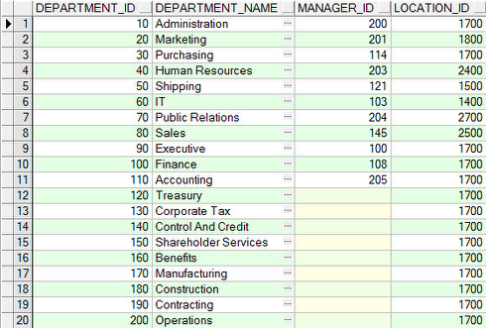
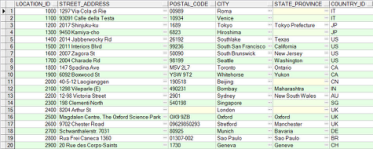
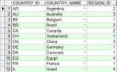
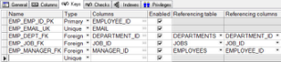

## 2.1  数据库表简介
 

&emsp;&emsp;通过第1章图1.36可以看到，HR用户可以操作的用户表共有七个，它们的基本情况如表2.1所示。

表2.1  HR用户表简介

| 序    号 | 表    名    | 表  作  用                                                   |
| -------- | ----------- | ------------------------------------------------------------ |
| 1        | EMPLOYEES   | 雇员信息表，包括所在部门编号，所从事职位编号以及部门经理雇员编号等 |
| 2        | DEPARTMENTS | 部门信息表，包括部门所在地编号等                             |
| 3        | JOBS        | 职位信息表                                                   |
| 4        | LOCATIONS   | 所在地信息表，包括所在地所属国家编号等                       |
| 5        | COUNTRIES   | 国家信息表，包括国家所在大洲编号等                           |
| 6        | REGIONS     | 大洲信息表                                                   |
| 7        | JOB_HISTORY | 职位变迁表，包括雇员编号、职位编号、部门编号等               |

### 2.1.1  获取表数据  

&emsp;&emsp;第1章在简介PL/SQL Dev这个Oracle客户端工具如何使用的时候，已经介绍了通过选择表对象，右击Query data的方式获取表数据。接下来分别获取上述七个表的部分数据，直观感受这些表里到底存了什么数据。

- EMPLOYEES表（见图2.1）

  

图2.1  EMPLOYEES表数据
  

- DEPARTMENTS表（见图2.2）

  

图2.2  DEPARTMENTS表数据
  

- JOBS表（见图2.3）

  

图2.3  JOBS表数据
  

- LOCATIONS表（见图2.4）

  

图2.4  LOCATIONS表数据
  

- COUNTRIES表和REGIONS表（见图2.5和图2.6）

  

 图2.5  COUNTRIES表数据 
  

  

图2.6  REGIONS表数据
  

​                               

- JOB_HISTORY表（见图2.7）

  

图2.7  JOB_HISTORY表数据
  

&emsp;&emsp;在数据库这门课程中，我们把每一行数据整体称为一条“记录”，而把每一列的标题称为一个“字段”（如EMPLOYEE_ID、START_DATE等）。

### 2.1.2  获取表结构  

&emsp;&emsp;获取了七个表的部分表数据之后，读者对这些表已经有了直观的认识，并且似乎已经感觉到这些表之间的联系。接下来，要更进一步，查看这几个表的表结构，重点是表里有哪些字段，这些字段有什么要求。由于篇幅关系，这里仅以EMPLOYEES为例查看表结构，其他表要求大家自己查看。

&emsp;&emsp;在PL/SQL Dev中获取表结构的方法也很简单，选择表对象EMPLOYEES，右击Edit，再切换到Columns选项卡，得到如图2.8所示的内容。

  

图2.8  EMPLOYEES表结构
  

&emsp;&emsp;从图2.8中可以看出，EMPLOYEES表包含11个字段，分别是代表雇员编号字段EMPLOYEE_ID、雇员名（不含姓）字段FIRST_NAME、雇员姓字段LAST_NAME、邮箱字段EMAIL、电话字段PHONE_NUMBER、雇佣日期字段HIRE_DATE、职位编号字段JOB_ID、薪水字段SALARY、佣金百分比字段COMMISSION_PCT、所属经理编号字段MANAGER_ID和所属部门编号字段DEPARTMENT_ID。

&emsp;&emsp;数据库表中的每个字段都规定了特定的类型，存放在该字段中的值必须符合类型的要求，这和Java语言中的数据类型类似。Oracle中支持的数据类型，包括五个大类：字符型、数值型、日期时间型、大对象型、伪列型，每个大类中又包括很多详细的类型。这么多的类型都记忆下来比较困难，在学习阶段只需要记住一些日常开发中常使用到的类型就可以了。表2.2列出了这些Oracle常用数据类型。

表2.2  Oracle常用数据类型

| 类    型       | 含    义                                                     |
| -------------- | ------------------------------------------------------------ |
| CHAR(size)     | 存储固定长度的字符串。参数size指定了长度，如果存储的字符串长度小于size，用空格填充。默认长度为1，最长不超过2000字节 |
| VARCHAR2(size) | 存储可变长度的字符串。参数size指定了该字符串的最大长度。默认长度为1，最长不超过4000字节 |
| NUMBER(p,s)    | 存储变长的数字。既可以存储浮点数，也可以存储整数，p表示数字的最大位数（如果是小数包括整数部分、小数部分和小数点，p默认是38位），s表示小数位数 |
| DATE           | 存储定长的日期或时间。存储世纪、年、月、日、时、分、秒，存储范围从公元前4712年1月1日到公元后9999年12月31日 |
| TIMESTAMP      | 和DATE类型大致相同，不过TIMESTAMP精确到了秒后6位小数         |
| CLOB           | 存储单字节字符大数据。和VARCHAR2数据类型相似，可存储的数据最大可以达到4GB，可以用来存储非结构化的XML文档 |
| BLOB           | 存储无结构的二进制大数据。可存储的数据最大可以达到4GB，可以用来存储图像、视频、音频等信息 |
| ROWID          | 表中行的存储地址，该地址可以唯一标识数据库中的一行，可以使用 ROWID 伪列快速定位表中的一行 |
| ROWNUM         | 查询返回的结果集中行的序号，可以使用它来限制查询返回的行数   |

 

&emsp;&emsp;在学习了Oracle常用数据类型之后，再次查看图2.8显示的EMPLOYEES表中11个字段。可以发现，FIRST_NAME、LAST_NAME、EMAIL、PHONE_NUMBER和JOB_ID这些字段都是VARCHAR2类型，EMPLOYEE_ID、SALARY、COMMISSION_PCT、MANAGER_ID和DEPARTMENT_ID这些字段都是NUMBER类型，HIRE_DATE这个字段是DATE类型。

&emsp;&emsp;图2.8中第三列，指出该表中每个字段是否允许为空。从显示结果来看，EMPLOYEE_ID、LAST_NAME、EMAIL、HIRE_DATE、JOB_ID这五个字段不可以为空。

&emsp;&emsp;通过Columns选项卡，可以了解该表每个字段的属性，这是了解表结构的重点。同时也可以通过General、Keys、Checks、Indexes这四个选项卡（见图2.9～图2.12），分别了解该表的基本信息、键、约束和索引，这些内容会在后面的课程中详细介绍。

  

图2.9  General选项卡
  

  

图2.10  Keys选项卡
  

  

图2.11  Checks选项卡
  

  

图2.12  Indexes选项卡
  

