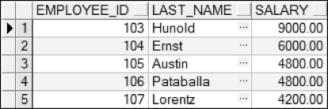

## 4.1  子查询
 

&emsp;&emsp;所谓子查询，就是查询中的查询。比如可以在一个SQL 语句的 WHERE 子句中写子查询，以获得所需要且之前未知的条件值。本节将介绍单行子查询和多行子查询。

### 4.1.1  子查询引入  

&emsp;&emsp;假设想要获取在部门编号为90的部门中，有哪些人的月薪比Abel（Abel是姓，即last_name）的月薪高，并把他们的姓氏显示出来。为了解决这个问题，需要分两个步骤：第一个步骤是获得Abel的月薪，第二个步骤是拿Abel的月薪值作为比较条件中的值，在部门编号为90的部门中查询。

&emsp;&emsp;上面的两个步骤实际上就是两个SELECT查询，可以用组合两个查询的方式解决这个问题，就是说把一个查询放到另一个查询中。通常将放进去的那个查询称为子查询或内查询，外面的查询称为主查询或外查询。SQL语句先执行子查询，并用子查询的结果作为主查询需要的值。完成上述功能的SQL语句如下：


```
SELECT last_name FROM employees

WHERE salary > (SELECT salary FROM employees WHERE last_name = 'Abel') AND department_id = 90
```


&emsp;&emsp;该SQL语句首先执行“SELECT salary FROM employees WHERE last_name = 'Abel'”，获得结果值6000；之后再执行“SELECT last_name FROM employees WHERE salary > 6000 AND department_id = 90”，运行结果如图4.1所示。


<p align="center"></p>  
<p align="center">图4.1  子查询</p>  

&emsp;&emsp;总结子查询的语法形式：


```
SELECT select_list1 FROM table1

WHERE expr operator(SELECT select_list2 FROM table2)
```


&emsp;&emsp;子查询是一个SELECT语句，它是嵌在另一个 SELECT 语句中的子句。使用子查询可以用简单的语句构建功能强大的语句，当需要从表中获取依赖于表本身的数据选择行时，子查询是非常有用的。

&emsp;&emsp;子查询可以放在WHERE子句中，也是本节要介绍的重点。同时也可以放在FROM子句以及之后要介绍的UPDATE 语句、INSERT语句、CREATE VIEW 语句、CREATE TABLE 语句、HAVING子句、INTO 子句和UPDATE语句的SET 子句中。

### 4.1.2  单行子查询  

&emsp;&emsp;从子查询中只返回一行结果的查询，称为单行子查询；对应的，如果返回多行的结果，就是多行子查询。另外还有多列子查询，即从查询语句中返回多列的查询。

&emsp;&emsp;单行子查询是从子查询返回一行的查询，对单行子查询的结果可以使用单行比较操作符。例如要显示编号为105的雇员所在部门所有人员的编号、姓氏和薪水，就可以使用子查询先查出编号为105的雇员的部门编号，再根据部门编号查出部门所有雇员的编号、姓氏和薪水。其SQL语句如下：


```
SELECT employee_id,last_name, salary FROM employees

WHERE department_id = (SELECT department_id FROM employees WHERE employee_id = 105)
```


&emsp;&emsp;该SQL语句是针对一个表使用了子查询，执行结果如图4.2所示。


<p align="center"></p>  
<p align="center">图4.2  单行子查询</p>  

&emsp;&emsp;上面的SQL语句查出的是这个部门所有雇员，如果仅想查出该部门中薪水高于编号105的雇员的信息，则需要再增加一个比较条件用于比较薪水，且具体的比较值由另一个子查询完成。其SQL语句如下：


```
SELECT employee_id,last_name, salary FROM employees

WHERE department_id = (SELECT department_id FROM employees WHERE employee_id = 105)

AND salary > (SELECT salary FROM employees WHERE employee_id = 105)
```


&emsp;&emsp;执行该SQL语句，运行结果如图4.3所示。


<p align="center"></p>  
<p align="center">图4.3  多个单行子查询</p>  

&emsp;&emsp;刚才查询的是该部门中薪水高于编号105的雇员信息，如果想查询出薪水大于公司雇员平均薪水的该部门雇员的信息，其SQL语句如下：


```
SELECT employee_id,last_name, salary FROM employees

WHERE department_id = (SELECT department_id FROM employees WHERE employee_id = 105)

AND salary >= (SELECT AVG(salary) FROM employees)
```


&emsp;&emsp;注意，在该语句的第二个子查询中，使用AVG(salary)函数求出了公司雇员平均薪水（6461.83元），AVG函数是组函数，本章后半部分会详细介绍。执行该SQL语句，运行结果如图4.4所示。


<p align="center"></p>  
<p align="center">图4.4  加入组函数的单行子查询</p>  

### 4.1.3  多行子查询  

&emsp;&emsp;子查询返回多行被称为多行子查询，对多行子查询要使用多行运算符而不是单行运算符，例如IN、ANY和ALL三个多行运算符。

l IN运算符

&emsp;&emsp;假设想知道在公司的所有雇员中，哪些雇员的薪水和部门编号为60的IT部门里雇员（雇员人数大于1人）的薪水相同，其SQL语句如下：


```
SELECT employee_id,last_name, salary,department_id FROM employees

WHERE salary IN (SELECT salary FROM employees WHERE department_id = 60)
```


&emsp;&emsp;执行该SQL语句，运行结果如图4.5所示。

&emsp;&emsp;分析一下这个多行子查询，先看子查询语句“SELECT salary FROM employees WHERE department_id = 60”，执行该语句返回结果如图4.6所示。


<p align="center"></p>  
<p align="center">图4.5  多行子查询</p>  
<p align="center"></p>  
<p align="center">图4.6  子查询结果</p>  


&emsp;&emsp;主查询在子查询结果的基础上执行，等价于执行如下的SQL语句，返回结果和图4.6相同。


```
SELECT employee_id,last_name, salary,department_id FROM employees

WHERE salary IN (9000,6000,4800,4800,4200)
```


- ANY运算符（同SOME运算符）和ALL运算符

&emsp;&emsp;ANY 运算符用于比较一个值与子查询返回的任一个值，而ALL 运算符用于比较一个值与子查询返回的每一个值。

&emsp;&emsp;< ANY子查询：小于子查询的最大值。

&emsp;&emsp;\> ANY子查询：大于子查询的最小值。

&emsp;&emsp;= ANY子查询：等同于IN子查询结果。

&emsp;&emsp;< ALL子查询：小于子查询的最小值。

&emsp;&emsp;\> ALL子查询：大于子查询的最大值。

&emsp;&emsp;如果想查询公司的所有雇员中，哪些雇员的薪水小于部门编号为60的IT部门里薪水最高的雇员的薪水，其SQL语句如下：


```
SELECT employee_id,last_name, salary, department_id FROM employees

WHERE salary < ANY(SELECT salary FROM employees WHERE department_id = 60)
```


&emsp;&emsp;执行该SQL语句，返回80行记录，部分运行结果如图4.7所示。


<p align="center"></p>  
<p align="center">图4.7  ANY运算符使用</p>  


