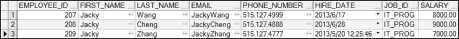

## 5.1  数据操纵语言DML
 

&emsp;&emsp;数据操纵语言（Data Manipulation Language，DML）是SQL语言的核心部分之一。在添加、更新或者删除数据库表中的数据时，需要执行DML语句。严格意义上讲，SELECT查询语句属于数据查询语言DQL，不属于数据操纵语言DML，但在实际工作中，多数研发人员、数据库管理员都将SELECT语句归入数据操纵语言中。

### 5.1.1  INSERT语句  

&emsp;&emsp;要将一行数据插入表中，需要使用INSERT语句，其语法形式如下：


```
INSERT INTO table[(column1, column2…)]

VALUES (value1,value2…)
```


&emsp;&emsp;其中table表示的是表名，column1,column2…是字段名列表，用“,”隔开，value1,value2…是字段对应值列表，同样用“,”隔开。

- 插入新行

&emsp;&emsp;假设现在公司新增加了一个部门，该部门的名称为开发部（Development），部门编号按规则设定为280，该部门的经理由IT部门经理兼任（IT部门经理编号为103），部门所在地编号为1700。则在部门表中增加该部门信息的SQL语句如下：


```
INSERT INTO departments(department_id, department_name, manager_id, location_id)

VALUES (280, 'Development', 103, 1700)
```


&emsp;&emsp;执行该SQL语句，提示一条记录被插入。执行下面的SQL语句进行查询（执行查询语句前，执行COMMIT语句，保证之前的操作对数据库起作用；同时需要打开另一个SQL窗口执行查询语句，保证数据显示正确），判断插入是否成功，运行结果如图5.1所示。


```
SELECT * FROM departments WHERE department_id = 280
```


<p align="center"></p>  
<p align="center">图5.1  INSERT语句使用</p>  


&emsp;&emsp;在使用INSERT语句时，字段名列表的顺序可以随意指定，不需要按照表中字段的顺序列出，但对应值列表必须和字段名列表对应。对应值列表中的值如果是字符类型和日期类型，需要使用单引号括起来。

&emsp;&emsp;在使用INSERT语句时，可以省略字段名列表，则对应值列表中必须按照实际表中字段的默认顺序逐个完整地排列。例如上面的INSERT语句可以写成：


```
INSERT INTO departments VALUES (280, 'Development', 103, 1700)
```


&emsp;&emsp;不过对于软件开发人员而言，为了让代码可读性高，建议不要省略字段名列表。

- 插入带空值的行


&emsp;&emsp;在本书第2章，介绍了如何在PL/SQL Dev中查看表的表结构。接下来先看一下部门表结构，如图5.2所示。


<p align="center"></p>  
<p align="center">图5.2  部门表结构</p>  


&emsp;&emsp;从图5.2中可以看出，部门表中经理编号和所在地编号是允许为空的。那么如何插入一个带空值的行呢？有两种方法，一种是隐式插入，另一种是显式插入。

&emsp;&emsp;隐式插入是省略空值的字段列表和值列表，其SQL语句如下：


```
INSERT INTO departments(department_id, department_name)

VALUES (290, 'Development1')
```


&emsp;&emsp;显式插入是在VALUES子句中指定NULL关键字或空字符串' '（针对字符串类型和日期类型），其SQL语句如下：


```
INSERT INTO departments

VALUES (300, 'Development2', NULL, NULL)
```


&emsp;&emsp;需要注意的是，只能对允许为空值的字段插入该字段为空值的行，而且插入新行需要满足该表的其他约束（本章后面的课程会详细介绍）。

- 插入日期值

&emsp;&emsp;假设需要给雇员表中添加一行雇员信息，该雇员信息中包括雇佣日期，其SQL语句如下：


```
INSERT INTO employees

VALUES (207, 'Jacky', 'Wang', 'JackyWang', '515.127.4999',

​        '17-6月-13', 'IT_PROG', 8000, NULL, 103, 60) 
```


&emsp;&emsp;Oracle日期类型默认格式为DD-MON-RR，所以如果以字符类型按日期的默认格式输入，Oracle会自动转换为日期类型。但如果用户输入的日期字符串不是默认的格式，则需要通过TO_DATE函数将字符类型显式地转换为日期类型。例如上面的SQL语句可以进行如下修改：


```
INSERT INTO employees

VALUES (208, 'Jacky', 'Cheng', 'JackyCheng', '515.127.4888',

​    TO_DATE('2013/06/28', 'YYYY/MM/DD')),

​    'IT_PROG', 9000, NULL, 103, 60)
```


&emsp;&emsp;该SQL语句中，通过指定格式模板的方式，将包含日期信息的字符类型转换为日期类型。

&emsp;&emsp;假设，把当前日期作为雇佣日期，添加到表中，则可以直接使用SYSDATE函数获得当期日期，其SQL语句如下：


```
INSERT INTO employees

VALUES (209, 'Jacky', 'Zhang', 'JackyZhang', '515.127.4777',

​    SYSDATE,  'IT_PROG', 7000, NULL, 103, 60)
```


&emsp;&emsp;通过下面的SQL语句，查看上面添加的三条雇员记录是否已经在雇员表中存在，运行结果如图5.3所示。


```
SELECT * FROM employees WHERE employee_id IN(207, 208, 209)
```


<p align="center"></p>  
<p align="center">图5.3  插入日期值</p>  


- 插入多行

&emsp;&emsp;假设因为有一些特殊的需求，需要在数据库中有一个存放IT部门雇员简要信息的表（it_emp），该表中仅有雇员编号、姓氏、雇佣日期和薪水四个字段信息。那么如何将雇员表中IT部门雇员的部分信息按要求插入it_emp表中呢？逐行获取每个雇员，再逐列获取每个字段的数据，然后再拼凑成每个单行插入语句，这个方法可以完成目标，但是其过程太过烦琐。可以通过在INSERT子句后面接SELECT子查询，将SELECT子查询获取的结果一次性插入表中。使用SELECT子查询插入多行的语法形式如下：


```
INSERT INTO table [(column1, column2…)]

SELECT col1, col2… FROM table2…
```


&emsp;&emsp;需要注意的是，INSERT子句中字段名列表的数目和数据类型必须和SELECT子句中选择的字段列表的数目和数据类型相匹配。it_emp表的表结构如图5.4所示，具体SQL语句如下，执行完该SQL语句之后，it_emp表内容如图5.5所示。


```
INSERT INTO it_emp(employee_id, last_name, hire_date, salary)

SELECT employee_id, last_name, hire_date, salary

FROM employees WHERE department_id = 60
```


<p align="center"></p>  
<p align="center">图5.4  it_emp表结构</p>  


<p align="center"></p>  
<p align="center">图5.5  it_emp表内容</p>  


 

###  5.1.2  UPDATE语句  

&emsp;&emsp;使用INSERT语句可以插入数据。在日常的软件开发需求中，经常需要修改数据，比如之前增加了开发部这个部门，增加这个部门时部门经理由编号为103的雇员担任，但经过一段时间之后，由于公司组织结构调整，该部门的经理改为由编号为102的雇员担任，这时候就需要修改数据库中表的记录，其SQL语句如下：


```
UPDATE departments SET manager_id = 102 WHERE department_id = 280
```


&emsp;&emsp;查看部门表中的信息，开发部manager_id字段的值已经修改为102。

&emsp;&emsp;UPDATE语句用于修改已经存在的行，其语法形式如下：


```
UPDATE table

SET column1 = value1, column2 = value2…

[WHERE…]
```


&emsp;&emsp;其中table表示的是表名，column1, column2…是要修改的字段名，value1,value2…是修改后的字段值。使用UPDATE语句时，通常需要使用WHERE子句进行限制，用来确定哪些行需要被更新。如果没有WHERE子句，则该表中的所有行都被更新。

- 更新多个字段

&emsp;&emsp;上面的例子，更新了manager_id这一个字段的值。下面则通过子查询的方式更新多个字段的值。假设需求为更新开发部的部门经理编号和所在地编号，用部门编号为60的IT部门的部门经理编号和所在地编号进行替换，其SQL语句如下：


```
UPDATE departments 

SET manager_id = (SELECT manager_id FROM departments WHERE department_id = 60),

​    location_id = (SELECT location_id FROM departments WHERE department_id = 60) 

WHERE department_id = 280
```


&emsp;&emsp;执行该SQL语句，再通过下面的SQL语句获取部门编号为60和280的部门信息，其结果如图5.6所示。


```
SELECT * FROM departments WHERE department_id IN(60,280)
```


<p align="center"></p>  
<p align="center">图5.6  UPDATE更新多列</p>  


- 字段的完整性约束

&emsp;&emsp;假设现在需要把之前添加的编号为207、208和209的三个雇员的职位编号修改为JAVA_PROG，其SQL语句如下：


```
UPDATE employees 

SET job_id = 'JAVA_PROG'

WHERE employee_id IN(207,208,209)
```


&emsp;&emsp;执行该SQL语句，提示“违反检查约束条件”，具体的原因在之后的课程中会详细介绍。这里简单提示一下，在设计雇员表时，对job_id字段设置了约束条件，要求在该字段里添加的值必须在职位表jobs中也存在，否则不让添加。

### 5.1.3  DELETE语句  

&emsp;&emsp;介绍了插入和更改，接下来要介绍如何从表中删除行。删除行使用的是DELETE语句，其语法形式如下：


```
DELETE  [FROM]  table

[WHERE…]
```


&emsp;&emsp;需要注意的是，DELETE语句执行前没有确认提示，但是该删除操作在数据处理的事务（后面会详细介绍）被提交之前并没有在数据库中被真正执行，如果发现出错，可提前执行ROOLBACK语句撤销该删除操作。

&emsp;&emsp;使用DELETE语句时，WHERE子句非常重要，因为如果DELETE语句中没有WHERE子句，则删除整个表可能造成严重后果。

&emsp;&emsp;下面来看一个案例，要删除部门表中部门编号为290和300的两个部门，其SQL语句如下：


```
DELETE departments

WHERE department_id IN(290,300)
```


&emsp;&emsp;执行该SQL语句，提示两行记录被删除。再次执行如下的SQL查询语句，观察删除后的结果（之前不执行COMMIT语句，同时在另一个SQL窗口中执行查询语句），运行结果如图5.7所示。


```
SELECT * FROM departments WHERE department_id > 270
```


<p align="center"></p>  
<p align="center">图5.7  DELETE语句使用结果</p>  


&emsp;&emsp;从运行结果可以看出，在没有执行COMMIT语句之前，虽然提示了两行记录已被删除，但实际数据库中仍然包含着部门编号为290和300的两个部门。要想让所做的删除立刻对数据库起作用，需要执行COMMIT语句，之后再执行查询编号大于270的部门，就只会显示一条记录了。

&emsp;&emsp;如果要在部门表中删除部门编号为90的部门记录，其SQL语句如下：


```
DELETE FROM departments WHERE department_id = 90
```


&emsp;&emsp;执行该SQL语句，提示“违反完整约束条件”，原因为雇员表中的部门编号对应部门表中的部门编号，雇员表中有department_id为90的雇员信息，所以不能删除部门表中department_id为90的部门信息数据。之前能够删除部门编号为290和300的两个部门，是因为雇员表中没有这两个部门编号的雇员。


