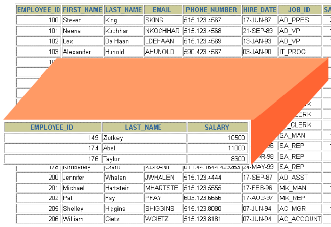
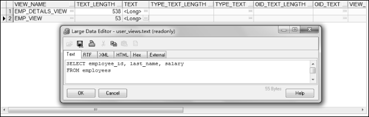
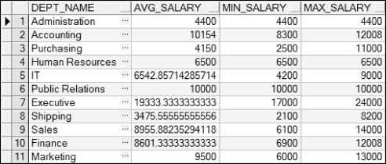

## 6.1  视图
&emsp;&emsp;本节主要介绍什么是视图，为什么要使用视图，视图的分类，以及如何创建视图，修改视图的定义和删除视图。

### 6.1.1  视图概述  

- 什么是视图

&emsp;&emsp;视图是表现数据的逻辑子集或数据的组合。视图是基于表或另一个视图的逻辑表，一个视图并不包含真实的数据，它提供了另一个视角查看或改变表中的数据，如图6.1所示。视图本质上就是一个SELECT语句。


<p align="center"></p>  
<p align="center">图6.1  视图概念</p>  


&emsp;&emsp;图6.1的视图由下面的SQL语句创建：


```
CREATE VIEW emp_view

AS 

​         SELECT employee_id, last_name, salary

​         FROM employees
```


- 为什么要使用视图

&emsp;&emsp;视图有两个方面的作用非常明显，使得其在数据库中广为使用。

&emsp;&emsp;其一是视图可以起到隐藏数据的功能。因为视图可以选择性地显示表中的字段和行。比如雇员表，里面包括雇员编号、名字、姓氏、EMAIL、电话和薪水等字段，假设针对某类用户，希望这些用户可以看到除雇员薪水以外的其他字段的信息，可以使用视图达到隐藏数据的功能。创建一个视图，该视图包括除薪水以外的其他字段，然后将这个视图授权给这类用户访问，并取消这类用户对雇员表的访问权限，这样就达到了隐藏雇员薪水的目的。

&emsp;&emsp;其二是视图可以将复杂的多表连接查询的结果构成一个简单的表结构提供给用户。出于数据库设计的考虑，需要把雇员相关的信息存放到多个表中。比如最核心的表是雇员表，之后通过雇员表中的部门编号连接到部门表，通过部门表中的所在地编号连接到所在地表，通过国家编号连接到国家表，通过大洲编号连接到大洲表。但在数据库把雇员相关的信息展现给用户（包括程序开发人员）的时候，往往需要把相关信息通过多表查询的方式连接成一个大的逻辑表方便用户使用，而这个大的逻辑表就是视图。

&emsp;&emsp;视图还有一些其他的作用，比如相同的数据可以展现出不同的视图，提供用户访问等。

- 视图的分类

&emsp;&emsp;视图是一个逻辑表，并不是一个真实存在的表。通过视图，是否可以进行DML操作（包括插入、更新和删除，不包括查询）将是对视图进行分类的重要依据。

&emsp;&emsp;视图可以分为简单视图和复杂视图，两者的区别如表6.1所示。

表6.1  视图分类

| 特    性                    | 简单视图 | 复杂视图  |
| --------------------------- | -------- | --------- |
| 涉及表的数目                | 1个      | 1个或多个 |
| 是否包含函数                | 不包含   | 包含      |
| 是否包含数据分组            | 不包含   | 包含      |
| 是否可以通过视图进行DML操作 | 可以     | 不可以    |

 

- 视图的存储与执行

&emsp;&emsp;视图的本质是一个SELECT语句，可以通过查询数据字典视图USER_VIEWS来查看视图的名字和视图定义，构成视图的SELECT语句的文本被存储在一个LONG字段中。通过下面的SQL语句，可以获取数据字典视图USER_VIEWS的信息。


&emsp;&emsp;
SELECT * FROM USER_VIEWS
&emsp;&emsp;


&emsp;&emsp;执行该SQL语句，选择一个视图，单击TEXT字段LONG右边的小按钮，弹出视图的SELECT语句，如图6.2所示。


<p align="center"></p>  
<p align="center">图6.2  获取视图信息</p>  


&emsp;&emsp;当用户从视图中查询数据时，Oracle数据库将从数据字典视图USER_VIEWS中获得视图的定义，然后检查对视图基表的数据存储权限，之后将针对视图的查询转换成针对基表的查询操作。

### 6.1.2  简单视图  

- 语法形式

&emsp;&emsp;使用CREATE VIEW语句可以创建视图，其语法形式如下：


```
CREATE [OR REPLACE] [FORCE|NOFORCE] VIEW view[(aliaslist)]

AS subquery

[WITH CHECK OPTION [CONSTRAINT cname]]

[WITH READ ONLY]
```


&emsp;&emsp;其中，OR REPLACE表示如果视图已经存在则重新创建，FORCE表示创建视图而不管基表是否存在，NOFORCE表示只有在基表存在的情况下才创建视图（默认情况），view表示视图名，aliaslist表示别名列表（别名之间用逗号隔开，别名的个数需要和查询中选择的字段或表达式的个数一致），subquery表示子查询，WITH CHECK OPTION表示只有可访问的行在视图中才能被插入或更新，cname表示为CHECK OPTION约束指定的名称，WITH READ ONLY表示在该视图中不可执行DML操作。

&emsp;&emsp;视图的核心是子查询，在视图中，子查询可以包含复杂的SELECT语句，但不可以包含ORDER BY子句（如想排序，可以从视图中取数据时进行排序）。

- 创建视图

&emsp;&emsp;视图的作用之一就是隐藏数据，下面就针对雇员表创建一个视图，隐藏其他数据，只显示雇员编号、姓氏和雇佣日期这三个字段的信息，且它们的别名分别设置为id、Name和Start，其SQL语句如下：


```
CREATE OR REPLACE VIEW emp_hidedata_view("id", "Name", "Start")

AS SELECT employee_id, last_name, hire_date FROM employees
```


&emsp;&emsp;执行该SQL语句，之后通过PL/SQL Dev查看Views文件夹，如图6.3所示，显示视图已经创建成功。

&emsp;&emsp;右击该视图，选择Query data选项获取数据，部分显示结果如图6.4所示。


<p align="center"></p>  
<p align="center">图6.3  Views文件夹</p>  


<p align="center"></p>  
<p align="center">图6.4  获取视图内容</p>  

​                                        

&emsp;&emsp;删除视图非常简单，只要执行DROP VIEW vname语句即可，其中vname代表视图名。该语句从数据库中删除视图定义，但不影响用于建立视图的基表，但基于已删除视图上的其他视图或应用程序将无效。

- 查询视图

&emsp;&emsp;对于创建好的视图，可以像从表中查询数据一样从视图中获取数据，例如可以执行如下的SQL语句：


```
SELECT * FROM emp_hidedata_view

WHERE "id" BETWEEN 200 AND 207
```


&emsp;&emsp;执行该SQL语句，运行结果如图6.5所示。


<p align="center"></p>  
<p align="center">图6.5  从视图中查询数据</p>  


### 6.1.3  复杂视图  

&emsp;&emsp;复杂视图是子查询中涉及表的数目超过一个，或包含函数，或包含数据分组的视图。假设现在要创建这样一个视图，该视图包括部门名称、部门平均薪水、最低薪水和最高薪水（别名分别是dept_name、avg_salary、min_salary和max_salary），而这些数据是通过对雇员表employees分组计算得来的。创建视图的SQL语句如下：


```
CREATE OR REPLACE VIEW dept_salary_view(dept_name, avg_salary, min_salary, max_salary)

AS 

​         SELECT d.department_name, AVG(e.salary), MIN(e.salary), MAX(e.salary)

​         FROM employees e, departments d

​         WHERE e.department_id = d.department_id 

​         GROUP BY d.department_name
```


&emsp;&emsp;执行该SQL语句，之后通过PL/SQL Dev查看dept_salary_view视图的数据，如图6.6所示。


<p align="center"></p>  
<p align="center">图6.6  获取复杂视图数据</p>  


