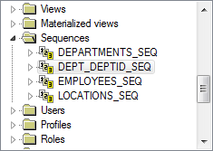
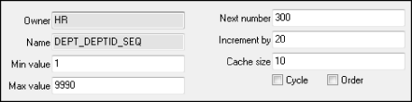

## 6.3  序列
 

&emsp;&emsp;作为程序开发人员，开发程序时往往要求数据库表中使用唯一的数字作为主键的值。可以在应用程序中产生这个数字提供给数据库进行保存，也可以让数据库通过序列产生这样一个唯一的数字。

### 6.3.1  创建序列  

&emsp;&emsp;序列是数据库对象，独立于表存储，可以为多个表使用。序列最主要的用途就是创建一个主键的值，并能确保这个主键的唯一性。

- 语法形式

&emsp;&emsp;用CREATE SEQUENCE语句可以定义一个序列，自动产生序列数，其语法形式如下：


```
CREATE SEQUENCE sequence

[INCREMENT BY n]

[START WITH n]

[{MAXVALUE n| NOMAXVALUE}]

[{MINVALUE n| NOMINVALUE}]

[{CYCLE | NOCYCLE}]

[{CACHE n| NOCACHE}];
```


&emsp;&emsp;sequence：序列的名字。

&emsp;&emsp;INCREMENT BY n：序列号之间的间隔（又称步长），n是一个整数，默认为1，如果该值为负值，该序列为降序序列。

&emsp;&emsp;START WITH n：第一个序列数，n默认为1。

&emsp;&emsp;MAXVALUE n：序列最大值，如果序列达到最大值，且不是继续循环产生序列值，则会提示序列超过最大值，序列最小值与此类似。

&emsp;&emsp;NOMAXVALUE：无最大值，默认对于升序序列最大值为1027，降序序列为-1。

&emsp;&emsp;MINVALUE n：序列最小值。

&emsp;&emsp;NOMINVALUE：无最小值，默认对于升序序列最小值为1，降序序列为-1026。

&emsp;&emsp;CYCLE|NOCYCLE：序列在到达它的最大或最小值之后，是否继续循环产生，默认不循环产生，如果序列用于主键值，为了避免破坏唯一性，应不使用循环产生。

&emsp;&emsp;CACHE n| NOCACHE：指定Oracle数据库预先分配多少值保存在内存中，默认为20个值。在内存中，缓冲序列可以提高对序列的存取速度，在第一次使用到序列时，一定数量的序列值被存入缓存，之后针对下一个序列值的请求可以直接从缓存中获取，提高性能。

- 创建序列

&emsp;&emsp;不知道读者是否已经注意到，部门表的部门编号起于10，之后都是20、30、40…保持着一定的规律。程序开发人员可以通过插入数据时按此规律编辑部门编号的方式完成这样的要求，同时也可以采用数据库序列的方式做到这点。

&emsp;&emsp;下面创建一个序列，命名为dept_deptid_seq，用于给部门表设置主键，创建序列的SQL语句如下（需要删除掉之前添加的部门编号大于270的部门）：


```
CREATE SEQUENCE dept_deptid_seq

INCREMENT BY 10

START WITH 280

MAXVALUE 9990

NOCYCLE

NOCACHE
```


&emsp;&emsp;执行该SQL语句，之后通过PL/SQL Dev查看Sequences文件夹，如图6.8所示，显示序列已经创建成功。


<p align="center"></p>  
<p align="center">图6.8  Sequences文件夹</p>  


&emsp;&emsp;序列的相关信息被存储在数字字典中，可以通过访问数据字典视图USER_SEQUENCES来查看序列的相关信息，例如可以通过下面的SQL语句获得所有序列的序列名、最后值、最小值、最大值和步长，结果如图6.9所示。


```
SELECT sequence_name, last_number, min_value, max_value, increment_by

FROM user_sequences
```


<p align="center"></p>  
<p align="center">图6.9  获取序列信息</p>  


&emsp;&emsp;从查询的结果可以看出，刚创建的序列dept_deptid_seq和该数据库中原有的departments_seq序列类似，这也就说明了为什么部门表中的部门编号有之前所说的规则。

### 6.3.2  使用序列  

&emsp;&emsp;前面只是创建了序列，并没有将这个序列应用到任何一张表中。接下来，将介绍如何通过NEXTVAL和CURRVAL这两个伪列，将序列应用到表中。

- NEXTVAL、CURRVAL

&emsp;&emsp;NEXTVAL伪列返回下一个可用的序列值（针对不同的用户值也是返回一个不同的唯一值），可以通过“序列名.NEXTVAL”引用这个值，此时一个新的序列值被产生并存到CURRVAL中。

&emsp;&emsp;CURRVAL伪列获得当前的序列值，NEXTVAL必须在CURRVAL引用前，在用户当前的会话中产生一个序列数，然后通过“序列名. CURRVAL”引用这个值。

&emsp;&emsp;通常可以在如下地方使用NEXTVAL、CURRVAL这两个伪列：

&emsp;&emsp;（1）SELECT语句中的字段列表（非子查询）。

&emsp;&emsp;（2）INSERT语句中子查询的字段列表。

&emsp;&emsp;（3）INSERT语句中的VALUES子句。

&emsp;&emsp;（4）UPDATE语句中的SET子句。

- 使用序列

&emsp;&emsp;假设要重新在部门表中插入开发部（Development）这个部门，其部门经理编号为103，部门所在地编号为1700，使用序列值产生部门编号，其SQL语句如下：


```
INSERT INTO departments

VALUES (dept_deptid_seq.NEXTVAL, 'Development', 103, 1700)
```


&emsp;&emsp;执行该SQL语句，并提交事务，经确认，部门表中增加了表示开发部的一条记录，部门编号为280，如图6.10所示。


<p align="center"></p>  
<p align="center">图6.10  使用序列插入数据</p>  


&emsp;&emsp;需要注意的是，此时dept_deptid_seq.CURRVAL的值为280。如果需要将这个新建部门的雇员信息插入雇员表employees中，则可以使用如下的SQL语句（需要删除之前添加的雇员编号大于107的雇员）：


```
INSERT INTO employees (employee_id, department_id, ...) 

VALUES (employees_seq.NEXTVAL, dept_deptid_seq.CURRVAL, ...)
```


&emsp;&emsp;此时dept_deptid_seq.CURRVAL的值为280，代表的是开发部的雇员。在该SQL语句中，又使用了序列employees_seq，这是本数据库中原有的序列，在图6.9中可以了解到该序列的信息。

&emsp;&emsp;需要注意的是，序列可能产生间隙。尽管序列可以按照间隔无间隙产生序列值，但序列的产生不依赖于事务结束，也就是说，如果有一个DML语句从序列中获取了序列值并执行，但因为其他原因该DML语句被回滚，而序列不跟着回滚，该序列值将会丢失，产生序列的间隙。另外一种情况就是系统崩溃产生序列间隙，这里不展开讲述。

### 6.3.3  修改和删除序列  

- 修改序列

&emsp;&emsp;修改序列的语法和创建序列类似，只是将CREATE改成了ALTER，且START WITH选项不可以修改，具体语法形式如下： 


```
ALTER SEQUENCE sequence

[INCREMENT BY n]

[{MAXVALUE n| NOMAXVALUE}]

[{MINVALUE n| NOMINVALUE}]

[{CYCLE | NOCYCLE}]

[{CACHE n| NOCACHE}];
```


&emsp;&emsp;修改序列的用户，必须是被修改序列的所有者或者用户具有ALTER权限，使用ALTER SEQUENCE修改序列，只有以后的序列值会受到影响，之前的不受影响。并且修改序列的部分选项不能使原有序列产生错误，例如不能将序列的最大值修改为小于当前的序列值。

&emsp;&emsp;例如要修改刚才创建的序列dept_deptid_seq，将间隔改为20，并开启序列缓存，保存10个值，其SQL语句如下：


```
ALTER SEQUENCE dept_deptid_seq

INCREMENT BY 20

CACHE 10
```


&emsp;&emsp;执行该SQL语句，之后通过PL/SQL Dev查看Sequences文件夹，右击如图6.8所示的dept_deptid_seq序列对象，并选择编辑，打开如图6.11所示的结果。从图中可以看出，间隔已经调整为20，且开启了保存10个值的序列缓存。


<p align="center"></p>  
<p align="center">图6.11  修改序列</p>  


- 删除序列

&emsp;&emsp;似乎所有的创建、修改都比较麻烦，而删除总是那么简单。同样的，序列的删除也是一样，只要使用DROP SEQUENCE sequence语句即可。 


