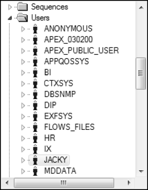
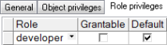
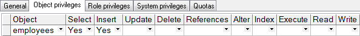

## 7.1  访问控制

 

&emsp;&emsp;在前面的章节中，一直使用HR用户登录数据库，访问并操作数据库对象。本节将介绍如何添加新的用户，赋予不同级别的访问权限，控制对数据库对象的访问。

&emsp;&emsp;Oracle是一个多用户访问的数据库服务器，提供了对数据库级别的访问控制、对数据库对象级别的访问控制，并能授予和撤销对对象的各种访问权限。

&emsp;&emsp;访问数据库并使用数据库对象需要权限，用户需要系统权限来访问数据库，需要对象权限来操作数据库对象。数据库管理员是一个特殊的用户，该用户本身可以访问数据库并操作数据库对象，同时还具有授予用户访问数据库及对象的权限。但并不是所有的授权都是由数据库管理员完成的，他们可以将这种授权的权利分配给其他用户，使其他用户在可授权的范围内进行授权。

### 7.1.1  创建用户  

&emsp;&emsp;要想给用户分配系统权限和对象权限，首先要创建用户。创建用户也需要权限，如果使用HR用户访问Oracle数据库，执行创建用户的SQL语句，Oracle会提示“权限不足”。那么可以使用具有数据库管理员身份的用户SYS来访问数据库，创建用户。

&emsp;&emsp;创建用户的语法形式如下：


```
CREATE USER user

IDENTIFIED BY password
```


&emsp;&emsp;其中user和password就是该用户的用户名和密码。例如通过下面的SQL语句，创建一个用户名为jacky的用户，密码为jacky123456。


```
CREATE USER jacky 

IDENTIFIED BY jacky123456
```


&emsp;&emsp;执行该SQL语句（SYS账户），之后通过PL/SQL Dev查看Users文件夹，如图7.1所示，显示jacky用户创建成功。

&emsp;&emsp;数据库管理员可以使用下面的语法形式给用户重置密码，用户也可以用此语法修改自己的密码。


```
ALTER USER user 

IDENTIFIED BY password
```


<p align="center"></p>  
<p align="center">图7.1  创建用户</p>  

### 7.1.2  系统权限  

&emsp;&emsp;创建了用户jacky之后，数据库管理员就可以给这个用户授予指定的系统权限。给一个用户授权的简要语法形式如下：


```
GRANT privilege1[,privilege2…]

TO user | role | PUBLIC
```


&emsp;&emsp;其中privilege1、privilege2…表示要授予的权限，user表示用户的名字，role表示角色（后面会介绍）名字，PUBLIC表示每一个用户都被授权。

&emsp;&emsp;作为程序开发人员，常被授予的系统权限包括以下五项。

&emsp;&emsp;（1）允许用户登录：CREATE SESSION。

&emsp;&emsp;（2）允许创建表：CREATE TABLE。

&emsp;&emsp;（3）允许创建视图：CREATE VIEW。

&emsp;&emsp;（4）允许创建序列：CREATE SEQUENCE。

&emsp;&emsp;（5）允许创建过程：CREATE PROCEDURE。

&emsp;&emsp;下面的SQL语句实现了将前四个权限授予给jacky用户的目的。


```
GRANT create session, create table, create view, create sequence

TO jacky
```


&emsp;&emsp;执行该SQL语句，相关系统权限被授予jacky用户。在图7.1所示的界面中，右击jacky用户，选择Edit选项，在弹出的窗口中选择System privileges（系统权限）选项卡，结果如图7.2所示，四个权限已经授予了jacky用户，可以使用jacky用户访问数据库了。


<p align="center"></p>  
<p align="center">图7.2  授予系统权限</p>  

&emsp;&emsp;在图7.2中，第二列Grantable的含义是jacky用户是否有权限将第一列相关的系统权限授权给其他用户，默认情况下是不允许的，这个授予权限的权限也需要授权，在PL/SQL Dev图形界面下，直接选中即可。

&emsp;&emsp;还是在图7.2中，刚才选择的是第四个系统权限选项卡，细心的读者已经观察到，第二个Object privileges是对象权限选项卡，第三个Role privileges是角色权限选项卡，打开之后分别能看到jacky用户拥有哪些对象权限和角色权限。

### 7.1.3  角色权限  

&emsp;&emsp;数据库的系统权限、用户权限很多，如果针对每个用户逐个分配每个权限，是一项复杂且容易出错的工作。而且一类用户需要分配的权限往往也是一致的，此时可将相关的一系列的权限组成一个命名的组，这个权限组就是角色。角色拥有的权限称为角色权限，将角色权限授予用户（又称为给用户指定角色），则这个角色权限所拥有的权限就全部授予了这个用户。一个用户可以被指定为多个角色，这个用户就同时拥有这多个角色所拥有的全部权限。

&emsp;&emsp;角色必须由数据库管理员创建，数据库管理员为用户指定角色，创建角色的语法如下：


```
CREATE ROLE role
```


&emsp;&emsp;其中role为角色名，数据库管理员可以使用GRANT语句将权限授予角色，也可以给用户指定角色。下面的SQL语句分别实现了创建角色、将权限授予角色和给用户指定角色。


```
CREATE ROLE developer;

GRANT create table, create view, create sequence, create procedure TO developer;

GRANT developer TO jacky;
```


&emsp;&emsp;执行SQL语句，通过PL/SQL Dev查看Roles文件夹，找到developer角色，右击developer角色，选择Edit选项，在弹出的窗口中单击打开System privileges选项卡，如图7.3所示，确定developer角色拥有被授予的四个权限。再单击打开用户jacky的Role privileges选项卡，确定jacky用户被指定为developer角色，如图7.4所示。


<p align="center"></p>  
<p align="center">图7.3  授予角色权限</p>  
<p align="center"></p>  
<p align="center">图7.4  给用户指定角色</p>  


&emsp;&emsp;Oracle数据库内置了一些角色，可供数据库管理员直接使用。对于程序开发人员使用的Oracle用户，数据库管理员通常给这些用户指定为resource和connect角色，而对于最终用户使用的Oracle用户，通常仅指定为connect角色。关于这两个角色分别具有什么权限，读者可以查询相关的数据字典视图。

### 7.1.4  对象权限  

&emsp;&emsp;对象权限是在指定的表、视图、序列和过程等对象上执行特定操作的权限，这里的特定权限包括INSERT、DELETE、UPDATE和SELECT以及INDEX、ALTER、REFERENCES（引用权限）和EXECUTE（执行权限）。但并不是每个对象都可以被授予这些权限，表7.1列出了各个对象可以被授予哪些权限。

表7.1  对象可被授予的权限

| 对象权限   | 表（Table） | 视图（View） | 序列（Sequence） | 过程（Procedure） |
| ---------- | ----------- | ------------ | ---------------- | ----------------- |
| INSERT     | ●           | ●            |                  |                   |
| DELETE     | ●           | ●            |                  |                   |
| UPDATE     | ●           | ●            |                  |                   |
| SELECT     | ●           | ●            | ●                |                   |
| INDEX      | ●           |              |                  |                   |
| ALTER      | ●           |              | ●                |                   |
| REFERENCES | ●           | ●            |                  |                   |
| EXECUTE    |             |              |                  | ●                 |

 

&emsp;&emsp;用户创建对象，并指定对象的所有者（默认是创建对象的用户）。对象的拥有者有关于该对象的所有权限，可以授予其所拥有对象的权限给另一个用户或角色。而且，如果使用了WITH GRANT OPTION选项，则得到权限的用户可以再将权限授予其他的用户。

&emsp;&emsp;给一个用户授权对象权限的语法形式如下：


```
GRANT object_priv[(columnlist)]

ON object

TO user | role | PUBLIC

[WITH GRANT OPTION]
```


&emsp;&emsp;其中，object_priv表示将被授予的对象权限，可以包括多个对象权限，用逗号隔开。也可以不输入具体的对象权限，直接输入ALL，表示授予该对象所能拥有的所有权限。columnlist表示被指定授权的字段（表和视图中的）的列表，object表示被授权的对象，user表示用户的名字，role表示角色名字，PUBLIC表示每一个用户都被授权，WITH GRANT OPTION表示允许被授予权限的人再授予对象权限给其他用户和角色。

&emsp;&emsp;假设现在需要给jacky用户授予针对雇员表employees的查询和插入权限，因为雇员表的所有者是HR用户，所以用HR用户身份访问Oracle数据库，完成对jacky用户的授权工作。具体的授权SQL语句如下：


```
GRANT select, insert

ON employees

TO jacky
```


&emsp;&emsp;执行该SQL语句，给jacky用户授予了相关权限，通过PL/SQL Dev查看jacky用户的对象权限（用HR用户身份查看），如图7.5所示。

&emsp;&emsp;接下来使用jacky用户登录数据库，执行下面的SQL语句：


```
SELECT * FROM employees
```


<p align="center"></p>  
<p align="center">图7.5  授予对象权限</p>  

&emsp;&emsp;提示“表或视图不存在”，什么原因呢？不是刚刚给jacky用户授予了查询employees表的权限吗？其原因在于，在数据库中，方案（schema）是管理数据库对象的逻辑结构，一个数据库对象的全称应该是“方案名.对象名”（默认情况下方案名等于用户的名字），之前不使用方案名的原因是用户操作的数据库对象是本用户的对象，方案名可以省略。而现在是用jacky用户访问数据库，需要操作HR用户的employees对象，所以必须写全名，故正确的SQL语句如下（执行完后会获得对应的数据）：


```
SELECT * FROM hr.employees
```


&emsp;&emsp;仍然使用jacky用户访问数据库，如果执行的是更新或删除语句，则会提示“权限不足”。另外，在访问数据库对象时，总是带着方案名显然让人觉得不舒服，可以创建一个同义词（SYNONYM，需要有创建同义词的权限），通过同义词进行访问。具体的SQL语句如下：


```
CREATE SYNONYM emps FOR hr.employees;

SELECT * FROM emps;
```


&emsp;&emsp;表7.2列出了部分已授予权限的相关视图，可以通过这些视图了解权限授予的情况。注意使用什么用户身份访问数据库，查询的就是该用户相关权限信息。

表7.2  已授予权限视图

| 数据字典视图        | 说    明                                       |
| ------------------- | ---------------------------------------------- |
| ROLE_SYS_PRIVS      | 显示通过角色授予用户的系统权限                 |
| ROLE_TAB_PRIVS      | 显示通过角色授予用户的对象权限                 |
| USER_COL_PRIVS      | 显示列上的权限，用户是属主、授予者或被授予者   |
| USER_COL_PRIVS_MADE | 显示列上已授予的权限，用户是属主或授予者       |
| USER_COL_PRIVS_RECD | 显示列上已授予的权限，用户是属主或被授予者     |
| USER_ROLE_PRIVS     | 显示已授予给用户的所有角色                     |
| USER_SYS_PRIVS      | 显示已授予给用户的所有系统权限                 |
| USER_TAB_PRIVS      | 显示已授予给用户的所有对象权限                 |
| USER_TAB_PRIVS_MADE | 显示已授予给其他用户的对象权限，用户是属主     |
| USER_TAB_PRIVS_RECD | 显示已授予给其他用户的对象权限，用户是被授予者 |

### 7.1.5  撤销权限  

&emsp;&emsp;既然可以授予权限，同样也可以撤销权限。使用REVOKE语句可撤销已经授予用户的权限，通过WITH GRANT OPTION可以撤销给其他用户授权的权限。具体撤销授权的语法如下：

```

REVOKE privilege1[,privilege2…]

ON object

FROM user | role | PUBLIC

[WITH GRANT OPTION]

```

&emsp;&emsp;例如要撤销给jacky用户针对雇员表employees的插入权限（用HR用户身份操作），其SQL语句如下：

 

```

REVOKE insert

ON employees

FROM jacky

```

 

&emsp;&emsp;执行该SQL语句，针对雇员表的插入权限被撤销。此操作是撤销对象权限，接下来的SQL语句实现了撤销jacky用户创建序列的系统权限的功能。需要注意的是，执行此SQL语句需要用系统管理员账户。


```
REVOKE create sequence

FROM jacky
```


